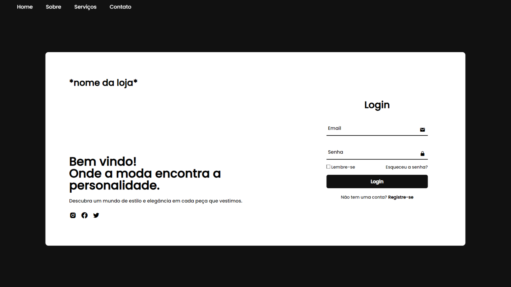

<h1 align="center"> Login & Registro </h1>

  

  

## 🚀 Tecnologias

Esse projeto foi desenvolvido com as seguintes tecnologias:

- HTML e CSS
- JavaScript
- Git e Github
- Canva

## 💻 Projeto

O login e registro são ferramentas essenciais que permitem aos usuários acessar e personalizar suas experiências em nosso site ou aplicativo, garantindo a segurança de suas informações e facilitando futuras interações.

- [Acesse o projeto finalizado, online](https://scatolon.github.io/Login-e-Registro)

## :memo: Licença

Esse projeto está sob a licença MIT.

---

Feito por Gabriel Scatolon :wave:
